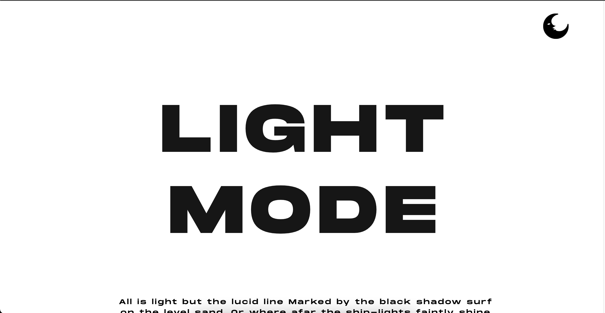
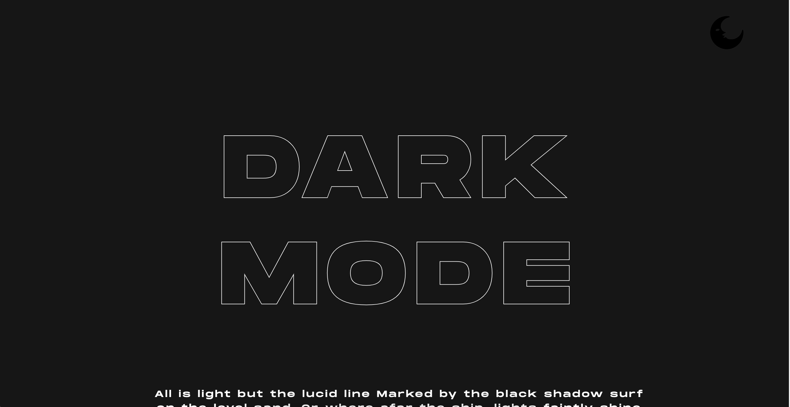

# dark-mode

Dark mode function using jQuery is a simple code part to demonstrate the transition between light-mode and dark-mode by using a toggle. This project was developed to test out my skills in jQuery technology. And it comes pretty well.

> Live [demo](https://iruthayasanthose.github.io/dark-mode/).

## Table of Contents

- [General Info](#general-information)
- [Technologies Used](#technologies-used)
- [Screenshots](#screenshots)
- [Question](#question)
- [Project Status](#project-status)
- [Acknowledgements](#acknowledgements)
- [Contact](#contact)
<!-- * [License](#license) -->

## General Information

- Dark mode & light mode using a toggle.
- It changes the text and background color according to the theme.
- It changes the content of the webpage respectiveto the the current theme.

## Technologies Used

- HTML5
- CSS3
- jQuery

## Screenshots

## Question

- `How the colors of background & text are changing, while you press the toggle?`
  DM the answer at [@iruthaya\_\_](https://www.instagram.com/iruthaya__/).

## Project Status

Project is: _complete_

## Acknowledgements

- This project was inspired by a online article.

## Contact

Created by [@iruthaya\_\_](https://www.instagram.com/iruthaya__/) - feel free to contact me!

<!-- ## License -->
